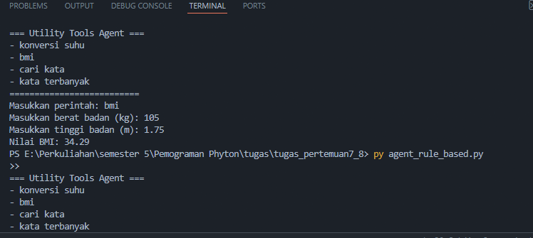

# Tugas Praktikum Python & AI Agent

## Identitas Mahasiswa
- **Nama**          : IZUDDIN ARGA EKO SARTONO
- **NIM**           : 230103265
- **Kelas**         : TI23C1
- **Program Studi** : TEKNIK INFORMATIKA
- **Mata Kuliah**   : PEMROGRAMAN PYTHON
- **Dosen**         : TRYONO, M.Kom.

---

## Deskripsi Tugas

Implementasi lengkap **Praktikum 7 & 8** tentang Python AI Agent dengan fitur:

## Hasil Screenshot

### 1. Konversi Suhu

### 2. BMI

### 3. Cari Kata

### 4. Pembuatan Soal

