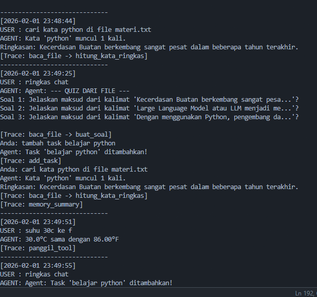
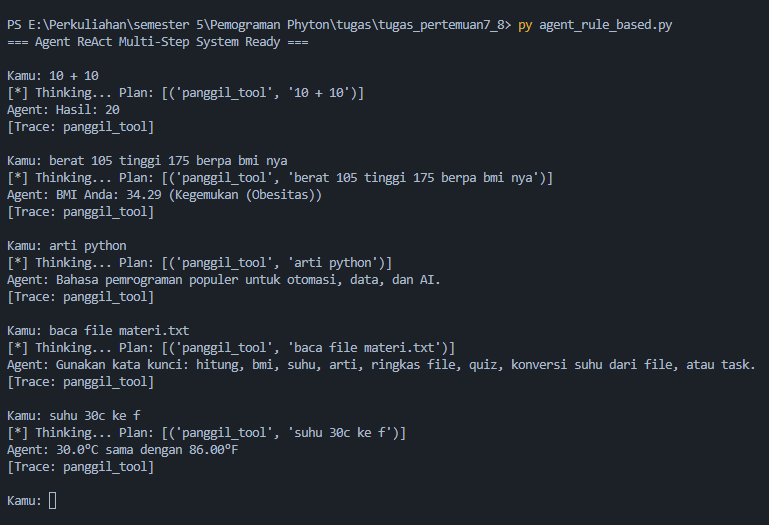
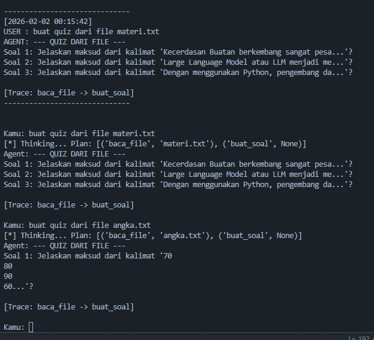
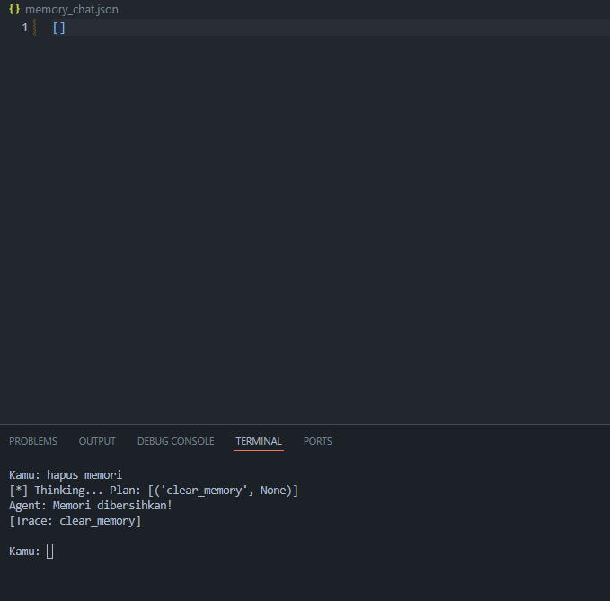
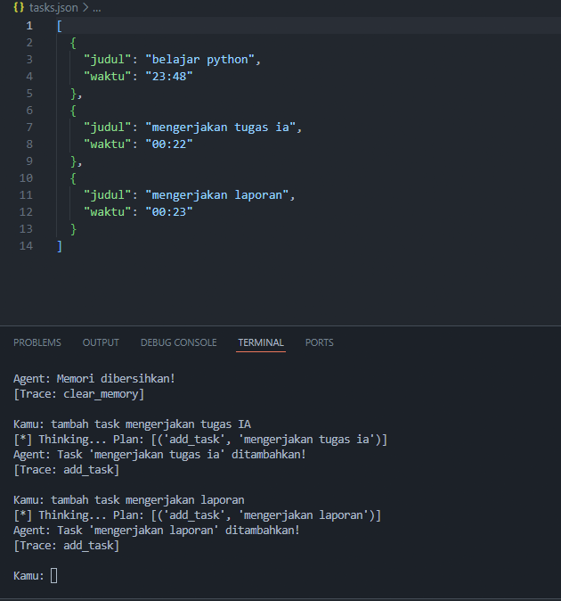

# Tugas Praktikum Python & AI Agent

## Identitas Mahasiswa
- **Nama** : IZUDDIN ARGA EKO SARTONO
- **NIM** : 230103265
- **Kelas** : TI23C1
- **Program Studi** : TEKNIK INFORMATIKA
- **Mata Kuliah** : PEMROGRAMAN PYTHON
- **Dosen** : TRYONO, M.Kom.

---

## Deskripsi Tugas
Implementasi lengkap Praktikum 7 & 8 tentang Python AI Agent dengan fitur ReAct (Reason + Act), Memory management, dan Multi-step reasoning.

## Hasil Screenshot

### 1. Ringkasan

### 2. Kalkulator dan pembaca suhu

### 3. Quiz

### 4. Hapus memori

### 5. Menambahkan task

## Refleksi Praktikum

### Refleksi 1 (Materi 7: Dasar AI Agent & Rule-Based)
**Apa kelemahan agent rule-based dibanding agent LLM-based?** 

Jawab: Sangat kaku, tidak memahami konteks bahasa alami, dan hanya bisa merespons perintah yang polanya sudah didaftarkan secara eksklusif.

**Apa kelebihan agent rule-based?** 

Jawab: Hasil sangat konsisten (pasti), eksekusi cepat, tidak ada risiko halusinasi, dan tidak memerlukan biaya API LLM yang mahal.

**Error/masalah apa yang kamu temui hari ini?** 

Jawab: Terjadi file locking pada log_agent.txt saat VS Code mencoba menyimpan file yang sedang diperbarui secara otomatis oleh script Python.

### Refleksi 2 (Materi 8: Multi-Step Agent & Memory)

**Kenapa agent multi-step lebih kuat daripada 1-step?** 

Jawab: Karena mampu melakukan rangkaian tugas yang saling bergantung, seperti membaca data dari sebuah file terlebih dahulu lalu menganalisisnya secara otomatis (contoh: fitur Quiz).

**Apa risiko terbesar multi-step agent?** 

Jawab: Kegagalan berantai (error propagation); jika langkah awal (seperti baca file) gagal, maka seluruh langkah berikutnya akan menghasilkan output yang salah atau error.

**Error/masalah apa yang kamu temui hari ini?** 

Jawab: Input angka tinggi dan berat badan yang tertukar pada fungsi BMI, sehingga membutuhkan logika deteksi otomatis (angka besar sebagai tinggi, angka kecil sebagai berat).
